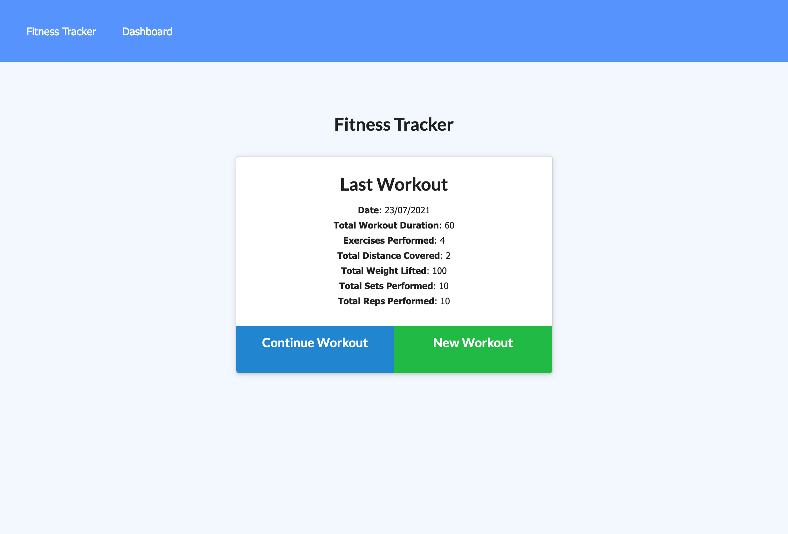
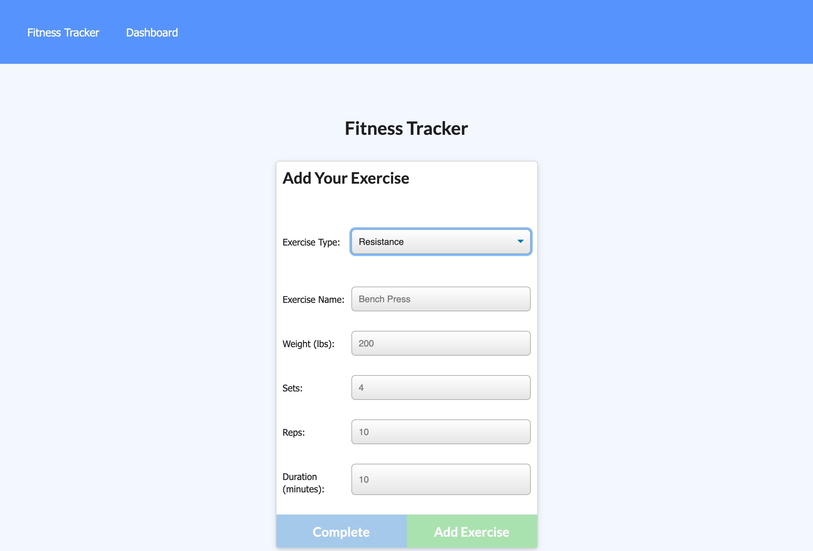
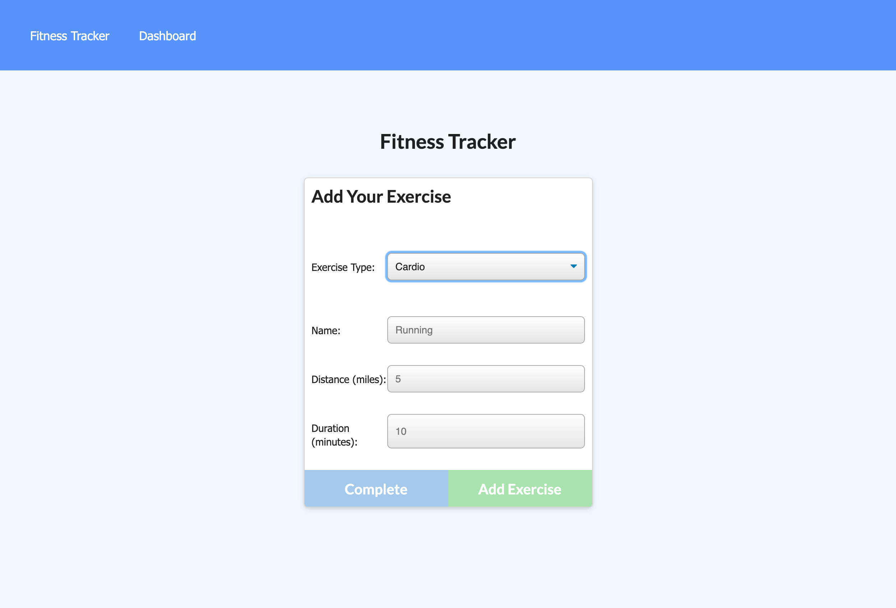
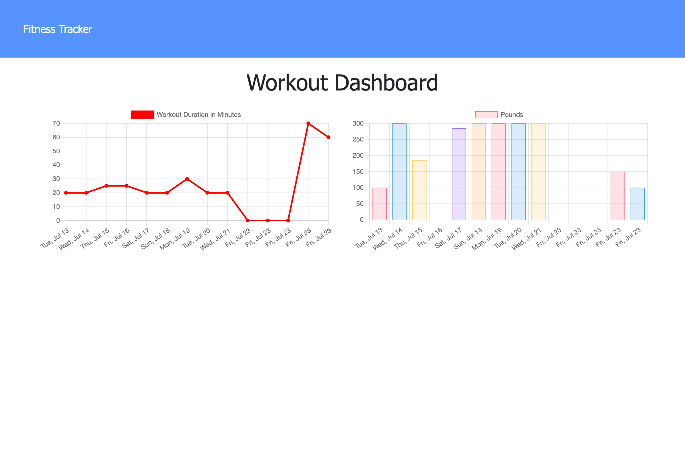

# Workout-Tracker

## This GitHub repository contains code for a Workout Tracker application.

---

### This application combines the use of an express server and a Mongo database with Mongoose ODM. Code for a basic API allows for API calls to be made that allow the user view, create and track daily exercises, with the ability to track multiple exercises on any given day. Exercises are added by category, resistance or cardio, and category dependent the user can track name, weight, sets, reps, distance and duration of each exercise. The combined weight and total duration for all workouts can be viewed on the stats page.

---

## Table of Contents

* [Usage](#usage)
* [Motivation and Research](#motivation-and-research)
* [Development](#development)
  * [Web development technologies](#web-development-technologies)
  * [Challenges](#challenges)
  * [Future Development Opportunities](#future-development-opportunities)
* [License](#license)
* [Contributing](#contributing)
* [Questions](#questions)
* [Repository Link](#repository-link)
* [Deployed Application Link](#deployed-application-link)
* [Application Screenshots](#application-screenshots)

---

## Usage

The deployed application can be accessed <a href="https://sheltered-cove-91239.herokuapp.com/">here.</a>

If you wish to deploy this application to your own Heroku instance you can sign up for a free Heroku account <a href="https://signup.heroku.com/">here.</a>

---

## Motivation and Research

The motivation behind this project was to begin to work with MongoDB, a NoSQL Object based database and the associated modules required to utilise it with NPM. Mongoose was used to specify an appropriate schema and classify the data types that would be stored within the database.

The application is designed to provide a Workout Tracker for the storing of Strength and Cardio based workouts. Exercises are added by category, resistance or cardio, and category dependent the user can track name, weight, sets, reps, distance and duration of each exercise. The combined weight and total duration for all workouts can be viewed on the stats page.

---

## Development

### Web development technologies

Development of the project was centered around using Express and MongoDB/Mongoose ODM, back end web applications for Node.js that are installed using the node package manager (NPM).

The application is deployed to Heroku, a platform as a service (PaaS) that enables developers to build, run, and operate applications entirely in the cloud..

Node.js, an open-source, cross-platform, back-end JavaScript runtime environment that runs on the V8 engine and executes JavaScript code outside a web browser.

Express is a minimal and flexible Node.js web application framework that provides a robust set of features for web and mobile applications.

MongoDB is a source-available cross-platform document-oriented database program. Classified as a NoSQL database program, MongoDB uses JSON-like documents with optional schemas.

Mongoose is an Object Data Modeling (ODM) library for MongoDB and Node.js. It manages relationships between data, provides schema validation, and is used to translate between objects in code and the representation of those objects in MongoDB.

Links to the languages and tools used to build this project are included below:

* Javascript ES6
* Node.js :
    * https://nodejs.org/
* NPM :
    * https://www.npmjs.com/
* NPM Packages :
    * Autoprefixer :
        * https://www.npmjs.com/package/autoprefixer
    * Dotenv :
        * https://www.npmjs.com/package/dotenv
    * Express :
        * https://expressjs.com/
    * Mongoose :
        * https://mongoosejs.com/
    * Morgan :
      * https://www.npmjs.com/package/morgan
    * Nodemon :
        * https://nodemon.io/
    * Postcss :
        * https://postcss.org/
* Heroku :
  * https://www.heroku.com/

### Challenges

The development of this application required the use of several NPM packages, including the installation of Autoprefixer, Dotenv, Express, Mongoose, Morgan, Nodemon and Postcss.

Using MongoDB as a back-end database provided a suitable database to contain the data for my application.This was a new area of learning which required research on how data is structured within MongoDB databases, as document structured databases differ from traditional SQL based databases I have utilized in the past.

The use of Mongoose within Node.js was also a new area of learning for me, allowing me to create a suitable schema for my workout tracker application, and define the data sets I wished to store within MongoDB, for display by the front-end web interface.

While I had previously used Heroku for some of my other applications, the specific implementation for a MongoDB based application was also a new area of learning. I required an understanding of how to link a Git repository to my Heroku instance, and the database specific connection strings required to start an instance of MongoDB within the Heroku cloud.

### Future Development Opportunities

Future development opportunities for the application can be focused on both the front and back ends of the application.

Revisiting existing stored workouts within the Workout Tracker interface would allow users to modify data that they had recorded if errors had occurred or if the same workout was performed. Allowing users to build workout templates would be advantageous, as often when working out a repetitive series of reps with gradually increasing weights is used for a period of time as the user begins to build muscle mass. This would require modifications to both the front-end interface and the back-end database to store the new document models.

Allowing for more granular statistics tracking would allow for better presentation of the data to the user, allowing them to filter by the various types of workouts that are recorded in the application and better understand their workout trends or time spent working out, allowing them to better realise their workout goals.

Integration with other fitness websites or tracking hardware via API access (for example FitBit, Google Fit, etc) could allow for workout data to be captured by other applications and stored within the developed application, but would require a significant development effort due to the requirement to learn about the various APIs and ways to access and store the data.

Developing the front end interface with a consistent branding experience for the UI and other presentation based artifacts that is aligned to my other applications is also planned, reflecting my professional brand and providing a consistent UI experience across all of my developed applications.

---

## License

This repository is licensed under the MIT license.

---

## Contributing

No contributions at this time.

---

## Questions

If you have any questions, check out my <a href="https://www.github.com/blmccavanagh">GitHub</a> or email me <a href="mailto:blmccavanagh@gmail.com">here</a>.

---

**Thank you for visiting.**

---

## Repository Link

* https://github.com/blmccavanagh/Workout-Tracker

---

## Deployed Application Link

* https://sheltered-cove-91239.herokuapp.com/

---

## Application Screenshots

*Home Page*

---

*Add Resistance Exercise*

---

*Add Cardio Exercise*

---

*Stats Page*

---